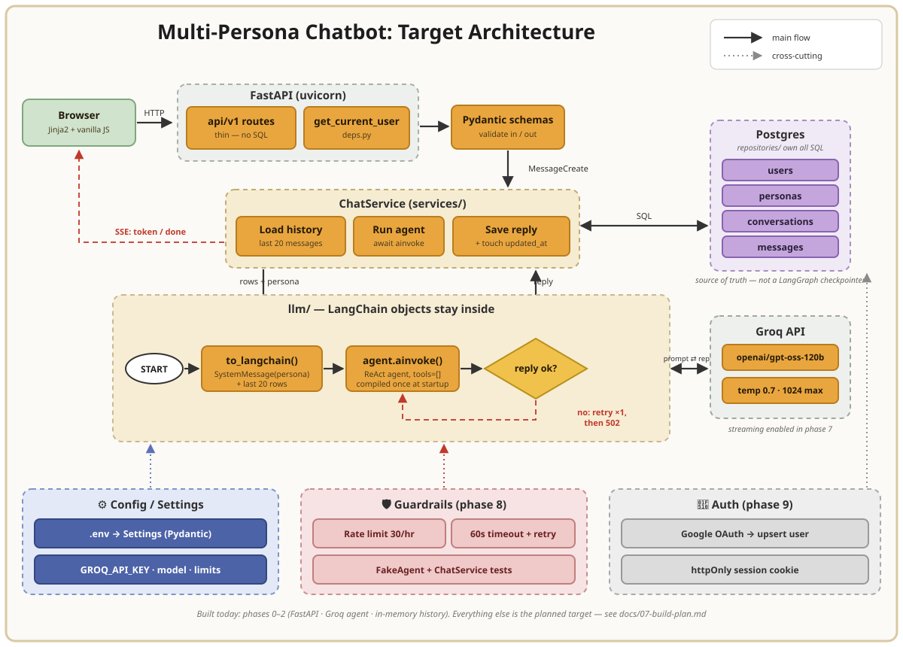

# Multi-Persona Chatbot

Pick a character when you start a conversation — a grumpy pirate, a cheerful
one, whoever — and it stays in character for the whole thread.

Each conversation is locked to one persona, saved to the database, and can be
reopened later to keep going.

```
┌──────────────────┐     ┌──────────────────────────┐
│ [Persona ▾]      │     │  you: where's the rum?   │
│ [+ New chat]     │     │  bot: Gone. Obviously.   │
│ ──────────────   │     │  you: gone where?        │
│ where's the rum  │     │  bot: Ask the crew.      │
│ pirate jokes     │     │ ──────────────────────── │
│ ship names       │     │ [type a message…] [send] │
└──────────────────┘     └──────────────────────────┘
```

---

## Tech stack

| Layer             | Choice                                        |
|-------------------|-----------------------------------------------|
| API               | FastAPI                                       |
| LLM orchestration | LangGraph (prebuilt ReAct agent) + LangChain  |
| Model             | Groq (`openai/gpt-oss-120b`) via `langchain-groq` |
| Database          | PostgreSQL + SQLAlchemy + Alembic             |
| Frontend          | Jinja2 + vanilla JS                           |
| Auth              | Google OAuth, httpOnly session cookie         |

---

## Target Design



Strict layering: routes contain no SQL and no prompt building, repositories know
nothing about HTTP, and LangChain objects never leave `llm/`.

Four tables:

```
users ──1:∞── conversations ──1:∞── messages
                    │
                   ∞:1
                    │
                personas
```

The app owns conversation history in plain tables rather than using LangGraph's
checkpointer, so listing a user's chats is an indexed `SELECT` instead of a
query over serialized blobs.

---

## API

Interactive docs at `/docs`.

```
GET    /api/v1/personas                         list available personas
POST   /api/v1/conversations                    start a chat, lock the persona
GET    /api/v1/conversations                    the sidebar
GET    /api/v1/conversations/{id}               a thread + all its messages
POST   /api/v1/conversations/{id}/messages      send a message → reply (SSE)
```

---

## Getting started

```bash
git clone <repo-url> && cd multi-persona-chatbot
uv sync

cp .env.example .env        # add your GROQ_API_KEY and DATABASE_URL
alembic upgrade head        # creates tables, seeds personas

uvicorn main:app --reload
```

Open http://localhost:8000 — or http://localhost:8000/docs for Swagger.

---

> Work in progress — the layout above is the target design. See the commit
> history for what's built so far.
