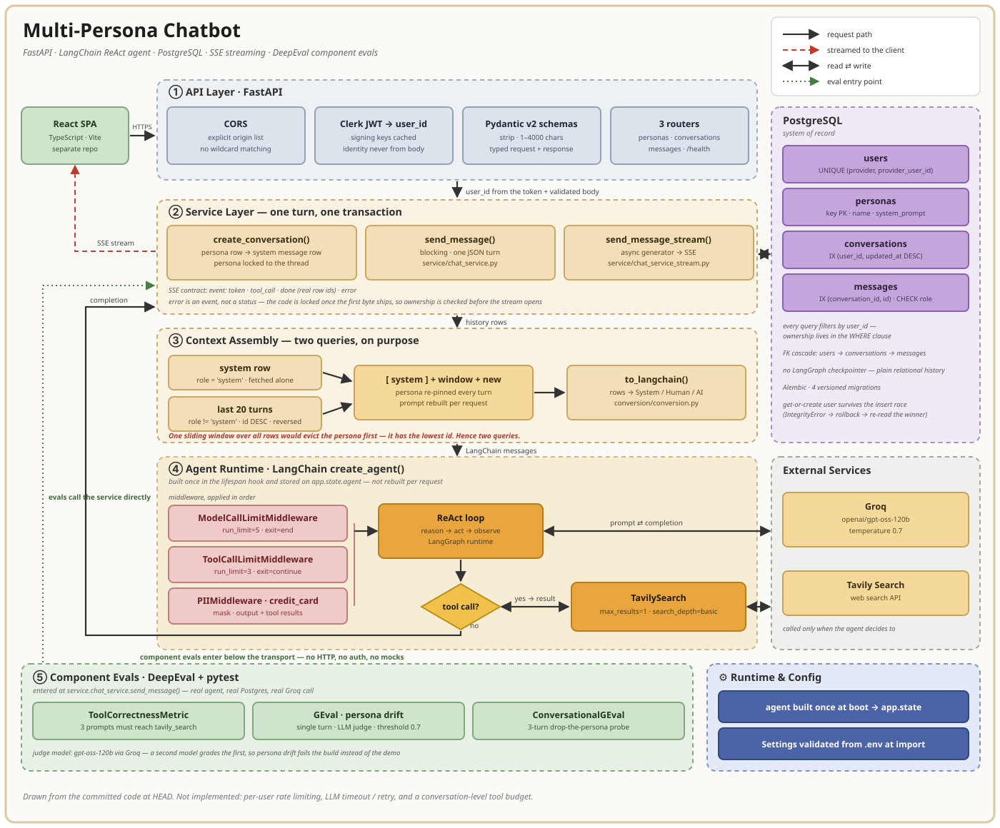

# Multi-Persona Chatbot

Pick a character when you start a conversation — a grumpy pirate, a cheerful
one, whoever — and it stays in character for the whole thread.

Each conversation is locked to one persona, saved to the database, and can be
reopened later to keep going.

```
┌──────────────────┐     ┌──────────────────────────┐
│ [Persona ▾]      │     │  you: where's the rum?   │
│ [+ New chat]     │     │  bot: Gone. Obviously.   │
│ ──────────────   │     │  you: gone where?        │
│ where's the rum  │     │  bot: Ask the crew.      │
│ pirate jokes     │     │ ──────────────────────── │
│ ship names       │     │ [type a message…] [send] │
└──────────────────┘     └──────────────────────────┘
```

---

## Tech stack

| Layer             | Choice                                        |
|-------------------|-----------------------------------------------|
| API               | FastAPI                                       |
| LLM orchestration | LangChain `create_agent` on LangGraph         |
| Model             | Groq (`openai/gpt-oss-120b`) via `langchain-groq` |
| Tools             | Tavily web search                             |
| Middleware        | Model/tool call limits + PII masking for card numbers |
| Database          | PostgreSQL + SQLAlchemy + Alembic             |
| Frontend          | Jinja2 + vanilla JS *(not built yet)*         |
| Auth              | Clerk — hosted sign-in, token verified per request |

---

## Target Design



Strict layering: routes contain no SQL and no prompt building, repositories know
nothing about HTTP, and LangChain objects never leave `llm/`.

Four tables:

```
users ──1:∞── conversations ──1:∞── messages
                    │
                   ∞:1
                    │
                personas
```

The app owns conversation history in plain tables rather than using LangGraph's
checkpointer, so listing a user's chats is an indexed `SELECT` instead of a
query over serialized blobs.

---

## API

Interactive docs at `/docs`.

```
GET    /health                                  liveness
GET    /personas                                list available personas
POST   /conversations                           start a chat, lock the persona
GET    /conversations                           the sidebar
GET    /conversations/{id}                      a thread + all its messages
POST   /conversations/{id}/messages             send a message → reply (JSON)
POST   /conversations/{id}/messages/stream      send a message → reply (SSE)
```

Everything under `/conversations` needs a Clerk session token:

```
Authorization: Bearer <token>
```

There are no `/auth/*` endpoints — Clerk hosts sign-in on its own domain, and
this API only verifies the token that comes back. Swagger's **Authorize** button
takes the same token.

---

## Getting started

```bash
git clone <repo-url> && cd multi-persona-chatbot
uv sync

cp .env.example .env
alembic upgrade head        # creates tables, seeds personas

uvicorn main:app --reload
```

Fill in `.env` before starting — the app will not boot without these:

| Variable | For |
|---|---|
| `POSTGRES_URL` | the database |
| `GROQ_API_KEY` | the model — https://console.groq.com/keys |
| `TAVILY_API_KEY` | web search — https://app.tavily.com |
| `CLERK_SECRET_KEY` | verifying session tokens — https://dashboard.clerk.com |
| `CLERK_AUTHORIZED_PARTIES` | comma-separated origins allowed to present a token. Defaults to `http://localhost:8000`. |

Open http://localhost:8000/docs for Swagger. There is no web UI yet, so you'll
need a Clerk session token to call anything under `/conversations`.

---

> Work in progress. Built: the API, the database, personas, SSE streaming, a
> web-search tool, and Clerk authentication. Not built: the browser UI and
> per-user rate limiting.
